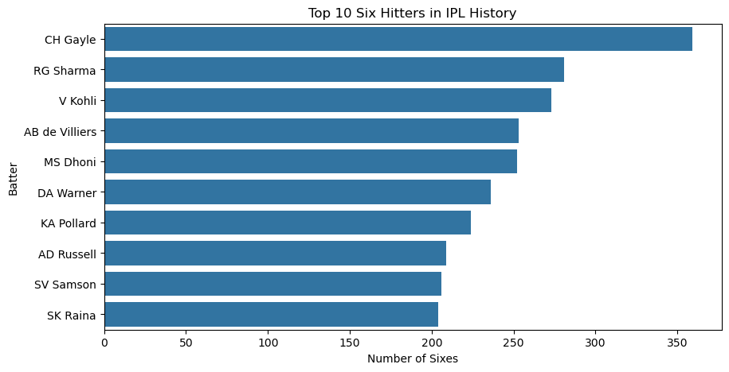
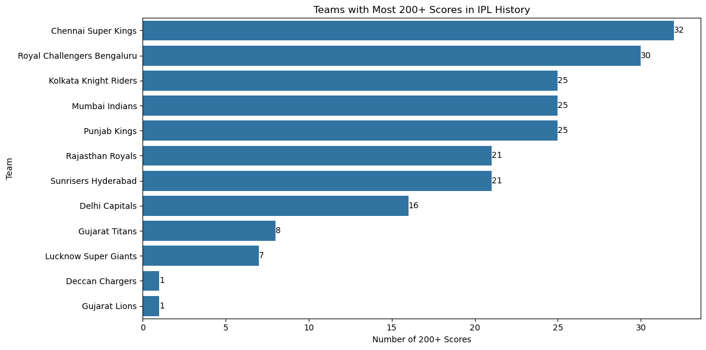
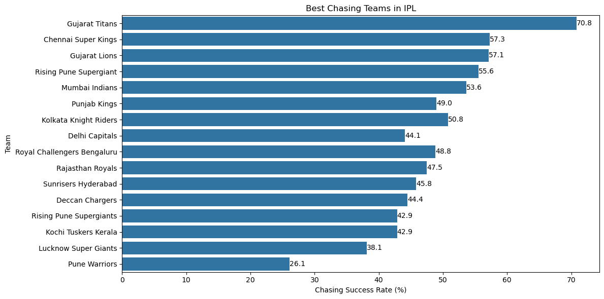

# IPL Analytics Project

## Overview

This project analyzes IPL match and ball-by-ball data using Python, Pandas, Matplotlib, and Seaborn.

The objective was to perform Exploratory Data Analysis (EDA) and answer cricket-related performance and business questions using real IPL data.

---

## Dataset

Dataset Source:

[IPL Complete Dataset (2008–2020)](https://www.kaggle.com/datasets/patrickb1912/ipl-complete-dataset-20082020)

Files Used:

* matches.csv
* deliveries.csv

---

## Technologies Used

* Python
* Pandas
* NumPy
* Matplotlib
* Seaborn
* Jupyter Notebook
* Git
* GitHub

---

## Analyses Performed

### Team Performance

* Teams with the most IPL wins
* Highest team scores in IPL history
* Teams with the most 200+ scores

### Batting Analysis

* Top 10 IPL run scorers
* Top 10 six hitters in IPL history

### Bowling Analysis

* Top wicket takers in IPL history

### Match Insights

* Impact of toss results on match outcomes
* Best chasing teams in IPL

### Data Cleaning

* Standardized historical franchise names
* Aggregated match-level and ball-by-ball data

---

## Visualizations

### Top Run Scorers

[
](https://github.com/Parthx007/ipl-analytics/blob/main/images/Top%2010%20IPL%20Run%20Scorers.png)
### Top Six Hitters
https://github.com/Parthx007/ipl-analytics/blob/main/images/Top%2010%20Six%20Hitters%20in%20IPL%20History.png

### Teams With Most 200+ Scores

[
](https://github.com/Parthx007/ipl-analytics/blob/main/images/Teams%20with%20Most%20200%2B%20Scores%20in%20IPL%20History.png)
### Best Chasing Teams

[](https://github.com/Parthx007/ipl-analytics/blob/main/images/Best%20chasing%20team.png)

---

## Project Structure

```text
ipl-analytics/

├── data/
│   ├── matches.csv
│   └── deliveries.csv

├── notebook/
│   └── ipl_analysis.ipynb

├── images/
│   ├── Best chasing team.png
│   ├── Teams with Most 200+ Scores in IPL History.png
│   ├── Top 10 IPL Run Scorers.png
│   └── Top 10 Six Hitters in IPL History.png

└── README.md
```

---

## Key Learnings

* Data Cleaning
* Exploratory Data Analysis (EDA)
* GroupBy Operations
* Data Aggregation
* Data Visualization
* Git Version Control
* GitHub Workflow

---

## Author

Parth Parashar

B.Tech AIML Student | Aspiring Software Developer
